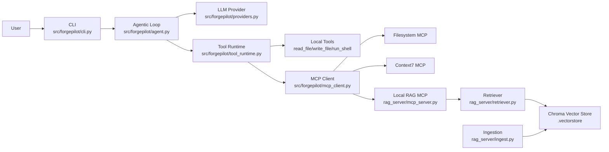
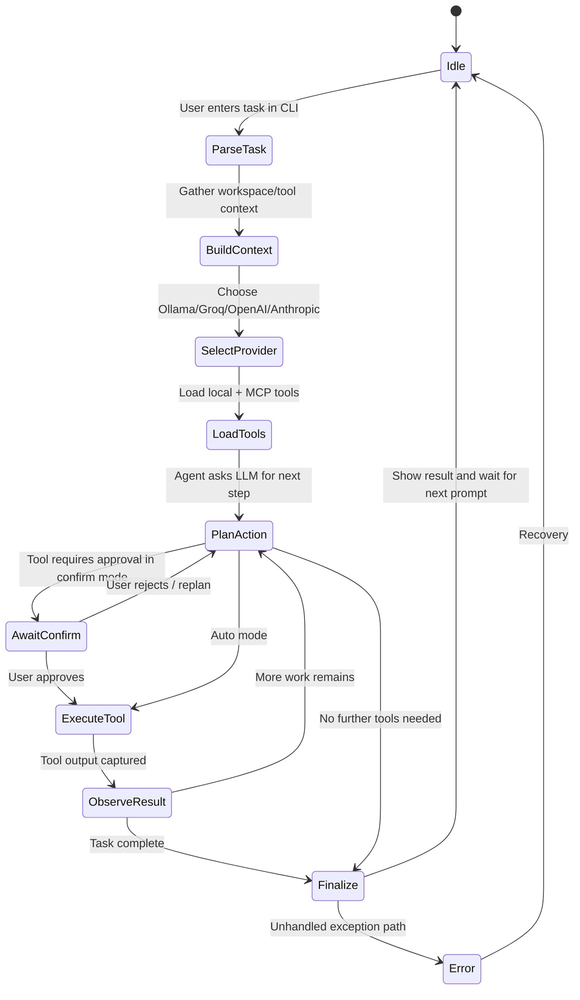
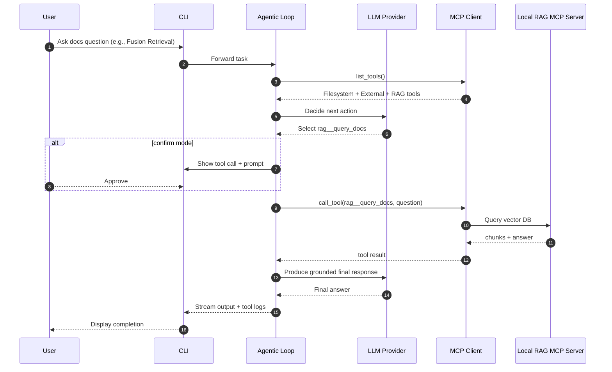
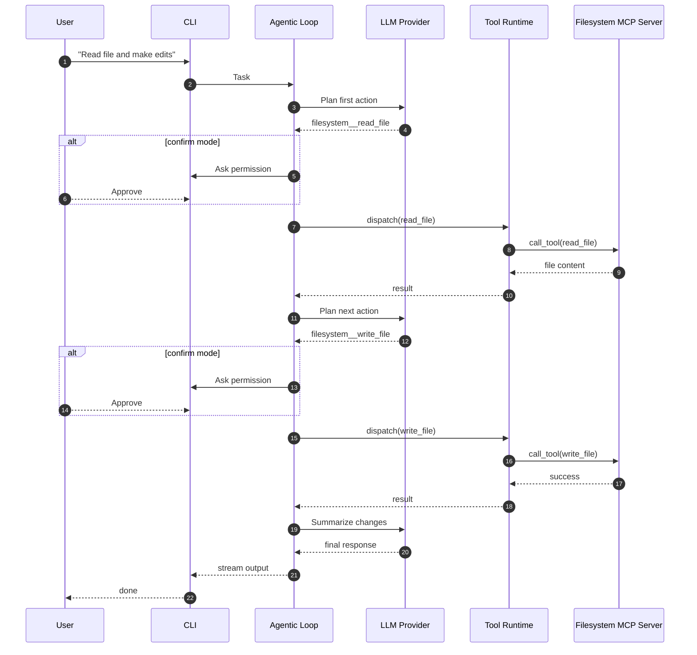

# Final Report — ForgePilot CLI Coding Assistant

## Project Summary

ForgePilot is a CLI coding assistant that supports:

- Multi-step agentic task execution
- Provider abstraction across Ollama/OpenAI/Anthropic/Groq
- MCP tool integration (filesystem, context7, local RAG)
- Confirm/auto execution modes
- Local RAG ingestion and retrieval pipeline

The implementation focuses on practical coding workflows: reading files, writing edits, running shell commands, and grounding responses with repository context.

## System Architecture

### Runtime Architecture (Components)

Source architecture narrative: [ARCHITECTURE.md](../ARCHITECTURE.md).

## State Diagram

Source file: [STATE_DIAGRAM.mmd](planning/STATE_DIAGRAM.mmd).

## Sequence Diagram — Scenario 1 (Documentation Query with RAG)

Source file: [SEQUENCE_SCENARIO_1_DOC_RAG.mmd](planning/SEQUENCE_SCENARIO_1_DOC_RAG.mmd).

## Sequence Diagram — Scenario 2 (Read/Edit File Flow)

Source file: [SEQUENCE_SCENARIO_2_READ_EDIT.mmd](planning/SEQUENCE_SCENARIO_2_READ_EDIT.mmd).

## Implementation Highlights

- Agent loop executes one action per step and uses structured JSON contracts.
- Parser hardening handles fenced JSON and malformed response recovery paths.
- Tool runtime enforces safety (`confirm`) and productivity (`auto`) modes.
- MCP integration namescopes tools and supports cross-platform env expansion.
- RAG pipeline uses chunking + embeddings + persistent vector storage with fusion retrieval.
- Deployment and usage docs now include accurate commands and common troubleshooting.

## Validation Evidence

- Unit/integration tests pass (`pytest -q`)
- Deployment checks exist in [DEPLOYMENT.md](../DEPLOYMENT.md)
- Usage guide exists in [HOW_TO_USE.md](../HOW_TO_USE.md)
- Demo video artifact: [docs/demo/demo-video.mp4](demo/demo-video.mp4)

## Limitations and Future Work

- Provider/model quality varies by availability and quota.
- Some hosted models may return incompatible tool-calling responses.
- Future improvement: stricter quality rubric and validator pass for generated markdown docs.
- Future improvement: export Mermaid diagrams to PNG/SVG for static submission bundles.

## Appendix: Artifact Index

- Architecture summary: [ARCHITECTURE.md](../ARCHITECTURE.md)
- State diagram source: [STATE_DIAGRAM.mmd](planning/STATE_DIAGRAM.mmd)
- Sequence 1 source: [SEQUENCE_SCENARIO_1_DOC_RAG.mmd](planning/SEQUENCE_SCENARIO_1_DOC_RAG.mmd)
- Sequence 2 source: [SEQUENCE_SCENARIO_2_READ_EDIT.mmd](planning/SEQUENCE_SCENARIO_2_READ_EDIT.mmd)
- Deployment guide: [DEPLOYMENT.md](../DEPLOYMENT.md)
- How-to guide: [HOW_TO_USE.md](../HOW_TO_USE.md)
